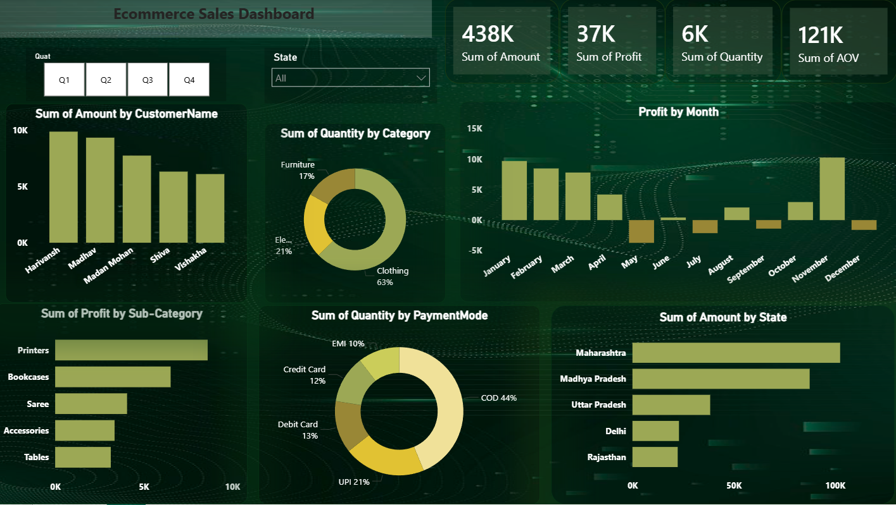

# Ecommerce Sale Dashboard - Power BI

## 📊 Project Overview

This project presents an interactive Ecommerce Sales Dashboard developed in Power BI to analyze and visualize sales performance across different dimensions. The dashboard provides valuable insights into customer behavior, regional sales distribution, product category performance, payment preferences, and profit trends, enabling data-driven business decisions.

---

## 🚀 Features

- Sales performance analysis
- Profit trend visualization
- Customer-wise sales analysis
- State-wise sales distribution
- Category-wise quantity analysis
- Payment mode distribution
- Monthly profit tracking
- Interactive filtering by quarter and state
- Dynamic and user-friendly visualizations

---

## 📈 Dashboard Insights

- Maharashtra generated the highest sales among all states.
- Clothing contributed the largest share of total quantity sold.
- Cash on Delivery (COD) was the most preferred payment method.
- Monthly profit trends reveal seasonal fluctuations in business performance.
- Top customers significantly contributed to overall revenue generation.

---

## 🛠️ Tools & Technologies

- Power BI
- Data Modeling
- Data Visualization
- Business Intelligence
- CSV Dataset

---

## 📋 Key Metrics

| Metric | Value |
|----------|----------|
| Total Sales Amount | 438K |
| Total Profit | 37K |
| Total Quantity Sold | 5615 |
| Average Order Value (AOV) | 121K |

---

## 📷 Dashboard Preview



---

## 🎯 Business Value

The dashboard helps stakeholders:

- Monitor sales performance effectively
- Identify high-performing states and customers
- Understand customer purchasing patterns
- Analyze category-wise demand
- Track profitability over time
- Support strategic business decisions through data insights

---

## 📂 Repository Structure

```text
ecommerce-sale-dashboard-powerbi/
│
├── Ecommerce_Sales_Dashboard.pbix
├── Dataset/
│   └── Ecommerce_Data.csv
├── Images/
│   └── dashboard_screenshot.png
└── README.md
```

---

## 📌 Future Enhancements

- Sales forecasting
- Customer segmentation analysis
- Product profitability analysis
- Advanced DAX measures
- Automated data refresh integration

---

## 👩‍💻 Author

**Abhilasha**

Power BI | Data Analytics | Business Intelligence Enthusiast

---

⭐ If you found this project useful, consider giving it a star.
